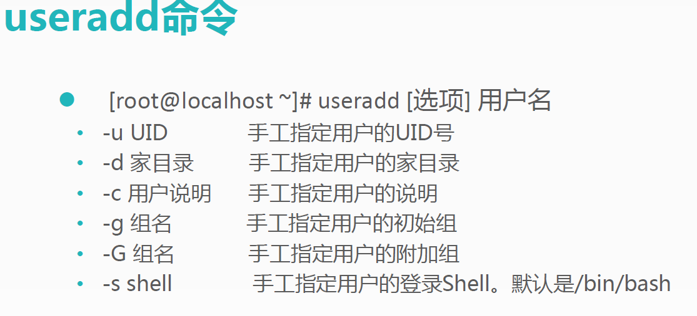
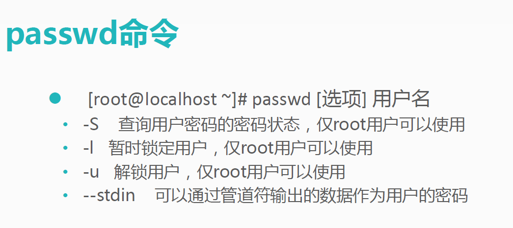
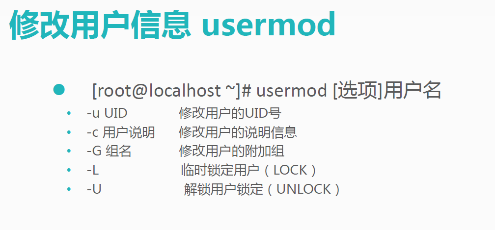
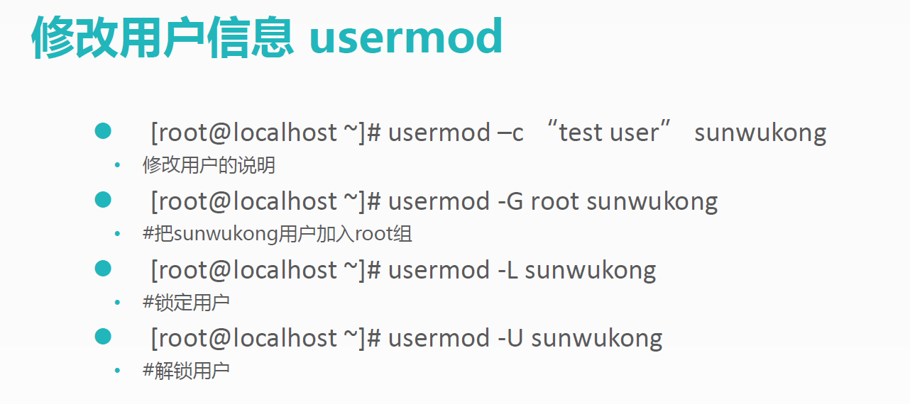
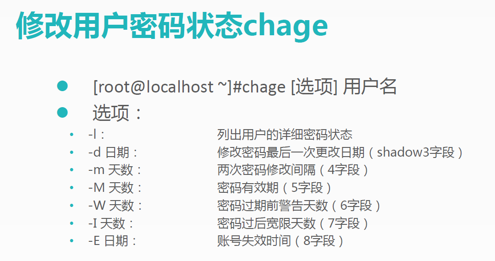
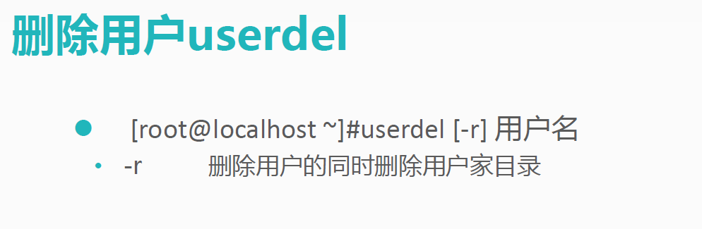
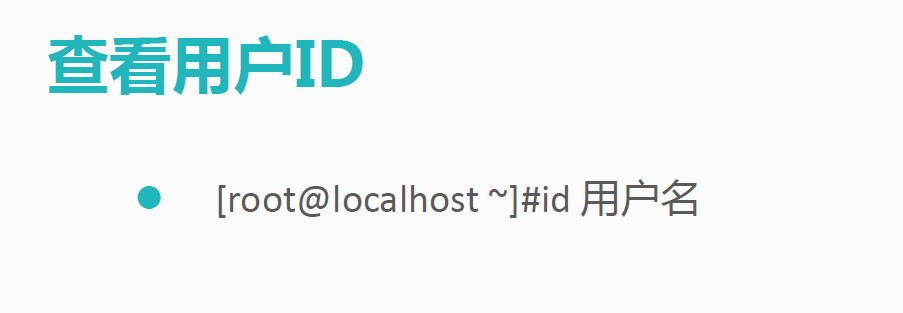
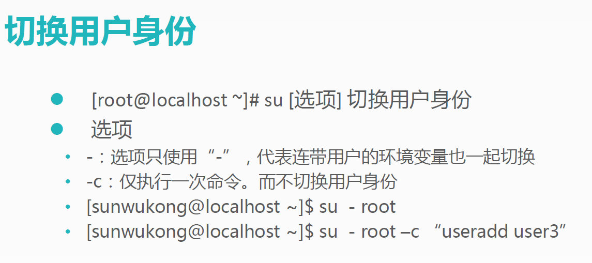

目录  
 一、文件处理命令  
	1. [ls](#ls)  
	2. [mkdir](#mkdir)  
	3. [cd](#mkdir)  
	4. [pwd](#pwd)    
	5. [rmdir](#rmdir)  
	5. [cp](#cp)  
	6. [mv](#mv)    
	6. [rm](#rm)    
	7. [touch](#touch)    
	8. [cat](#cat)  
	9. [tac](#tac)  
	10. [more](#more)  
	11. [less](#less)  
	12. [head](#head)  
	13. [tail](#tail)  
二、权限处理命令  
	1. [chmod](#chmod)  
	2. [chown](#chown)  
	3. [chgrp](#chgrp)  
	4. [umask](#umask)  
三、文件搜索命令  
	1. [find](#find)  
	2. [whereis](#whereis)  
	3. [grep](#grep)  
四、帮助命令    
	1. [man](#man)  
	2. [help](#help)    
五、用户管理命令  
	1. [useradd](#useradd)  
	2. [passwd](#passwd)  
	3. [w](#w)  
	4. [usermod](#usermod)  
	5. [change](#change)  
	6. [userdel](#userdel)  
	7. [查看用户](#查看用户)  
	8. [su](#su)  
六、压缩和解压命令   
	1. [tar](@tar)  
	2. [tar命令解压缩](#tar命令解压缩)  
	3. [zip](#zip)  
	4. [unzip](#unzip)  
	5. [bzip2](#bzip2)  
	6. [bunzip2](#bunzip2)  
七、网络命令  
	1. [write](#write)  
	2. [wall](#write)  
	3. [ping](#ping)  
	4. [ifconfig](#ifconfig)  
	5. [mail](#mail)  
	6. [last](#last)  
	7. [lastlog](#lastlog)  
	8. [traceroute](#traceroute)  
	9. [netstat](#netstat)  
	10. [setup](#setup)  
	11. [mount](#mount)  
八、关机重启命令  
	1. [shutdown](#shutdown)  
	2. [其他关机命令](#其他关机命令)  
	3. [其他重启命令](#其他重启命令)  
	4. [系统运行级别](#系统运行级别)  
	5. [退出登录命令](#退出登录命令)  

# 一、文件处理命令

## ls 

* 命令名称： ls

* 命令英文原意： list list

* 命令所在路径： /bin/ls

* 执行权限：所有用户

* 功能描述：显示目录文件

* 语法： ls 选项 [-ald ] [ 文件或目录 ]

	* -a 显示所有文件，包括隐藏•
	* -l 详细信息显示
	* 查看目录属性

* -rw-r--r--
	* 文件类型（-文件、d目录、l软链接文件）
	* u 所有者
	* g 所属组
	* o 其他人
	* r 读
	* w 写
	* x 执行

## mkdir

* 命令名称： mkdir

* 命令英文原意： make directories  

* 命令所在路径： /bin/mkdir

* 执行权限：所有用户

* 语法：mkdir -p [目录名]

* 功能描述：创建新目录

	* -p 递归创建

* 范例：
	* mkdir -p /tmp/liaoning/shenyang

	* mkdir /tmp/henan/zhengzhou

## cd

* 命令名称：cd

* 命令英文愿意：change directory

* 命令所在路径：shell内置命令

* 执行权限：所有用户

* 语法：cd [目录名]

* 功能描述:切换目录

* 范例:
	* cd/tmp/liaoing/shenyang（切换到指定目录）
	* cd ..（返回上一级目录）

## pwd

* 命令名称： pwd

* 命令英文愿意：print working directory

* 命令所在路径：/bin/pwd

* 执行权限：所有用户

* 语法：pwd
 
* 功能描述:显示当前目录

* 范例:

	* pwd

## rmdir

* 命令名称： rmdir

* 命令英文愿意：remove empty directories

* 命令所在路径：/bin/rmdir

* 执行权限：所有用户

* 语法：rmdir[目录名]

* 功能描述:删除空目录

* 范例:
	* rmdir /tmp/henan/zhengzhou

## cp

* 命令名称： cp

* 命令英文愿意：copy

* 命令所在路径：/bin/cp
 
* 执行权限：所有用户

* 语法：cp -rp [原文件或目录] [目标目录]

	* -r  复制目录
	
	* -p  保留文件属性
	 
* 功能描述:复制文件或目录

* 范例:
	* cp –r /tmp/Henan/zhengzhou /root
	
	* 将目录/tmp/Henan/zhengzhou复制到目录/root
	
	* cp -rp /tmp/Henan/zhengzhou /root
	
	* 将目录/tmp/Henan/zhengzhou到目录/root，保留目录属性
	
## mv

* 命令名称： mv

* 命令英文愿意：move
 
* 命令所在路径：/bin/mv
*
* 执行权限：所有用户
*
* 语法：mv [原文件或目录] 

* 功能描述:剪切文件、改名

	
## rm

* 命令名称： rm

* 命令英文愿意：remove

* 命令所在路径：/bin/rm

* 执行权限：所有用户

* 语法：rm -rf [文件或目录]
*  
	* -r 删除目录

	* -f 强制执行
* 功能描述:删除文件
 
* 范例:
	* rm /tmp/yum.log

	* rm -rf /tmp/henan/zhengzhou

## touch

* 命令名称： touch

* 命令所在路径：/bin/touch

* 执行权限：所有用户

* 语法：touch [文件或目录] 

* 功能描述:创建空文件

* 范例:
	* touch wahaha.list
	

## cat

* 命令名称：cat  

* 命令所在路径：/bin/cat

* 执行权限：所有用户
 
* 语法：cat [文件名] 

* 功能描述:显示文件内容

	* -n 显示行号
* 范例:
	* cat /etc/issue
	* 
	* cat -n /etc/services

## tac

* 命令名称：tac 

* 命令所在路径：/usr/bin/tac

* 执行权限：所有用户

* 语法：tac [文件名] 

* 功能描述:显示文件内容

* 范例:
	* tac /etc/issue

## more

* 命令名称：more 
 
* 命令所在路径：/bin/more

* 执行权限：所有用户

* 语法：more [文件名] 

	* 空格或f 翻页

	* enter 换行

	* Q或q 退出

* 功能描述:分页显示文件内容（反向显示）

* 范例:

	* more /etc/issue

## less

* 命令名称：less 

* 命令所在路径：/usr/bin/less

* 执行权限：所有用户

* 语法：less [文件名] 

* 功能描述:分页显示文件内容（可向上翻页）

* 范例:

	* less /etc/issue

## head

* 命令名称：head 
 
* 命令所在路径：/usr/bin/head

* 执行权限：所有用户

* 语法：head [文件名] 

* 功能描述:显示文件前面几行

	* -n 指定行数
* 范例:
	* head -n 20 /etc/issue

## tail

* 命令名称：tail 
 
* 命令所在路径：/usr/bin/tail

* 执行权限：所有用户
 
* 语法：tail [文件名] 

* 功能描述:显示文件后面几行

	* -n 指定行数

	* -f 动态显示文件未尾内容

* 范例:
* 
	* tail -n 20 /etc/issue

#  二、权限处理命令

## chmod

* 命令名称：chmod

* 命令英文愿意：change the premissions mode of a file

* 命令所在路径：/bin/chmod

* 执行权限:所有用户

* 语法：
	* chmod [{ugoa}{+-}{rwx}] [文件或目录]

	* [mode=421] [文件或目录]

	* -R 递归修改
	
* 功能描述:改变文件或目录权限

## 权限的数字表示

* r---5
* w---2
* x---1
* rwxrw-r--
* 7 6 4
* 范例:
	* chmod g+w testfile
	* 赋予文件testfile所属组写权限
	* chmod -R 777 testdir
	* 修改目录testdir及目录下恋恋不舍为所用户具有所有权限

## 文件目录李权限总结

|代表字符|权限|对文件的含义|对目录的含义|
|-------|-----|-------------|----------|
|r|读权限|可以查看文件内容|可以列出目录中的内容|
|w|写权限|可以修改文件内容|可以在目录中创建和删除文件|
|x|执行权限|可以执行文件|可以进入目录|

## chown

* 命令名称：chown
 
* 命令英文愿意：change file ownership

* 命令所在路径：/bin/chown

* 执行权限:所有用户

* 语法： chown [用户] [文件或目录]

* 功能描述:改变文件或目录的所有者

*  范例: chown guangguang zhengzhou

## chgrp

* 命令名称：chgrp

*命令英文愿意：change file group ownership

* 命令所在路径：/bin/chgrp

* 执行权限:所有用户

* 语法： chgrp [用户组] [文件或目录]

* 功能描述:改变文件或目录的所属组

*  范例: chgrp china zhengzhou

##  umask

* 命令名称：umask

* 命令英文愿意：the user file-creation mask

* 命令所在路径：Shell内置命令
 
* 执行权限:所有用户
 
* 语法： umask [-S]

	* -S 以rwx形式显示新建文件缺省权限

* 功能描述:显示、设置文件的缺省权限

*  范例: umask -S

# 三、文件搜索命令

## find

* 命令名称：find
 
* 命令所在路径:/bin/find
 
* 执行权限：所有用户
 
* 语法：fidn [搜索范围] [匹配条件]
 
* 功能描述:文件搜索
 
* 范例：
	* find /etc –size +163840 –a –size -204800  
		*（在/etc下查找大于80MB小于100MB的文件  
		* -a：两件文件同时满足  
		* -o：两个条件满足任意一个即可  
	
	* find /etc -name inittab -exec ls -l {}\;
		* -exec/-ok命令{}\;对搜索结果执行操作
		* -type 根据文件类型查找
		* -inum 根据i节点查找

## whereis

* 命令名称：whereis
 
* 命令所在路径:/usr/bin/whereis

* 执行权限：所有用户

* 语法：whereis [命令名称]

* 功能描述：搜索命令所在目录及帮助文档路径

* 范例：
	* whereis ls

## grep

* 命令名称：grep

* 命令所在路径:/bin/grep

* 执行权限：所有用户

* 语法：grep -iv [指定字符串] [文件]

* 功能描述：搜索命令所在目录及帮助文档路径
* 
	* -i 不区分大小写

	* -v 排除指定字符串
	
* 范例：
	* grep "mysql" /root/install.log

# 四、帮助命令

## man

* 命令名称： man

* 命令英文原意： manual 

* 命令所在路径： /usr/bin/man

* 执行权限：所有用户

* 语法： man [命令或配置文件 ]

* 功能描述：获得帮助信息

* 范例：
	* man ls 

	* man services 

## help

* 命令名称:help

* 命令所在路径：Shell 内置命令

* 执行权限：所有用户

* 语法：help [命令]

* 功能描述：获得Shell内置命令的帮助信息

* 范例：

	* help umask

# 五、用户管理命令

## useradd

* 用户管理：useradd

* 命令名称：useradd

* 命令所在路径：/usr/sbin/useradd

* 执行权限：root

* 语法：useradd用户名

* 功能描述：添加新用户

* 范例：

	* useradd guangguang

## passwd

* 命令名称：passwd

* 命令所在路径 /usr/bin/passwd

* 执行权限：所有用户

* 语法：passwd 用户名

* 功能描述：设置用户密码

* 范例：

	* passwd guangguang

## w

* 用户管理：w

* 命令名称：w

* 命令所在路径：/usr /bin/w /bin/w

* 执行权限：所有用户

* 语法：w

* 功能描述：查看登录用户详细信息

* 范例：
	* w

## usermod

## change

## userdel

## 查看用户

## su

# 六、压缩和解压命令

## tar

* 命令名称：tar

* 命令所在路径：/bin/tar

* 执行权限：所有用户

* 语法：tar 选项 [-zcf][压缩后文件名][目录]

	* -c 打包

	* -v 显示详细信息

	* -f 指定文件名

	* -z 打包同时压缩

* 功能描述：打包目录

* 压缩后文件格式 ：.tar.gz

* 范例：

	* tar –zcfzcf Henan.tar.gz Henan  （将目录Henan打包并压缩为 为 tar.gz文件）

## tar命令解压缩

* 语法:tar [-xzvf][压缩后文件名]

* -x 解包

* -v 显示详细信息

* -f 指定解压文件

* -z 解压缩

* 范例：

	* tar –zxvf Henan.tar.gz 

## zip

* 命令名称： zip

* 命令所在路径： /usr /bin/zip /bin/zip

* 执行权限：所有用户

* 语法： zip 选项 [-r][压缩后文件名][ 文件或目录 ]

	* -r 压缩目录

* 功能描述：压缩文件或目录

* 压缩后文件格式：.zip

* 范例：

	* zip wahaha.zip wahaha 

	* zip -r zhengzhou.zip zhengzhou3

## unzip

* 命令名称： unzip

* 命令所在路径：/usr/bin/unzip

* 执行权限：所有用户

* 语法：unzip [压缩文件]

* 功能描述：解压.zip的压缩文件

* 范例：

	* unzip wahaha.zip

## bzip2

* 命令名称：bzip2

* 命令所在路径 /usr/bin/bzip2 
*
* 执行权限：所有用户

* 语法：bzip2 选项 [-k][ 文件 ]

* 功能描述：压缩文件

* 压缩后文件格式： .bz2

* 范例：

	*bzip2 -k wahaha

##bunzip2

* 命令名称：bunzip2

* 命令所在路径： /usr/bin/bunzip2

* 执行权限：所有用户

* 语法： bunzip2 选项 [-k][ 压缩文件 ]

	* -k 解压缩后保留原文件

* 功能描述：解压缩

* 范例：

 	* bunzip2 -k wahaha.bz2

# 七、网络命令

## write

* 命令名称：write

* 命令所在路径： /usr/bin/write

* 执行权限：所有用户

* 语法：write 用户名

* 功能描述：给用户发信息，以 Ctrl+D Ctrl+D保存结束

* 范例：

	* write liyifeng

## wall

* 命令名称：wall

* 命令英文原意：write all

* 命令所在路径：/usr/bin/wall

* 执行权限：所有用户

* 语法：wall [message]

* 功能描述：发广播信息

* 范例：

	* wall LinZhiling is beautiful!

## ping

* 命令名称： ping

* 命令所在路径：/bin/ping

* 执行权限：所有用户

* 语法： ping 选项 IP 地址

	* -c 指定发送次数

* 功能描述：测试网络连通性

* 范例：

	* ping 192.168.1.113 

## ifconfig

* 命令名称：ifconfig

* 命令英文原意：interface configure

* 命令所在路径：/sbin/ifconfig 

* 执行权限：root

* 语法： ifconfig 网卡名称 IP 地址

* 功能描述：查看和设置网卡信息

* 范例：

	* # ifconfig eth0 192.168.83.241

## mail

* 命令名称 ：mail

* 命令所在路径：/bin/mail

* 执行权限：所有用户

* 语法： mail 用户名

* 功能描述：查看发送电子邮件

* 范例：

	* mail root

## last

* 命令名称：last

* 命令所在路径：/usr /bin/last /bin/last /bin/last

* 执行权限：所有用户

* 语法：last

* 功能描述：列出目前与过去登入系统的用户信息

* 范例：

	* last

## lastlog

* 命令名称：lastlog 

* 命令所在路径：/usr/bin/lastlog

* 执行权限：所有用户

* 语法：lastlog

* 功能描述：检查某特定用户上次登录的时间

* 范例：

	* lastlog
	
	* lastlog-u 502

## traceroute

* 命令名称：traceroute

* 命令所在路径：/bin/traceroute

* 执行权限：所有用户

* 语法：traceroute

* 功能描述：显示数据包到主机间的路径

* 范例：

	* traceroute edu.51cto.com

## netstat

* 命令名称： netstat 

* 命令所在路径： /bin/netstat

* 执行权限：所有用户

* 语法：netstat [选项 ]

* 功能描述：显示网络相关信息

## netstat

* 选项：

	* -t：TCPTCP 协议

	* -u：UDP 协议

	* -l：监听

	* -r：路由

	* -n：显示 IP 地址和端口号

* 范例：

	* netstat–tlun 查看本机监听的端口

	* netstat–an 查看本机所有的网络连接 查看本机所有的网络连接

	* netstat–rn 查看本机路由表

## setup

* 命令名称： setup 

* 命令所在路径：/usr/bin/setup

* 执行权限： root

* 语法： setup

* 功能描述：配置网络

* 范例：

	* setup

## mount

* 命令名称： mount

* 命令所在路径： /bin/mount

* 执行权限：所有用户

* 语法： mount[-t文件系统] 设备文件名 挂载点

* 范例：

	*  mount  –t iso9660 /dev/sr0/mnt/cdrom

# 八、关机重启命令

## shutdown 命令

* [root@localhos~]#shutdown [选项] 时间

* 选项：

	* -c：取消前一个关机命令

	* -h：关机

	* -r：重启

## 其他关机命令

[root@localhost~]# halt

[root@localhost~]# poweroff

[root@local~]# init 0

## 其他重启命令

* [root@local~]# reboot ~]# reboot

* [root@local~]# init 6

## 系统运行级别

* 0：关机

* 1：单用户

* 2：不完全多用户，含 ：不完全多用户，含 NFSNFSNFS服务

* 3：完全多用户

* 4：未分配

* 5：图形界面

* 6：重启

* [root@localhost~]# cat/etcetcetc/inittab（#修改系统默认运行级别）

* id:3:initdefault 

* [root@local ~]# runlevel（#查询系统运行级别）

## 退出登录命令

* [root@local~]# logout 