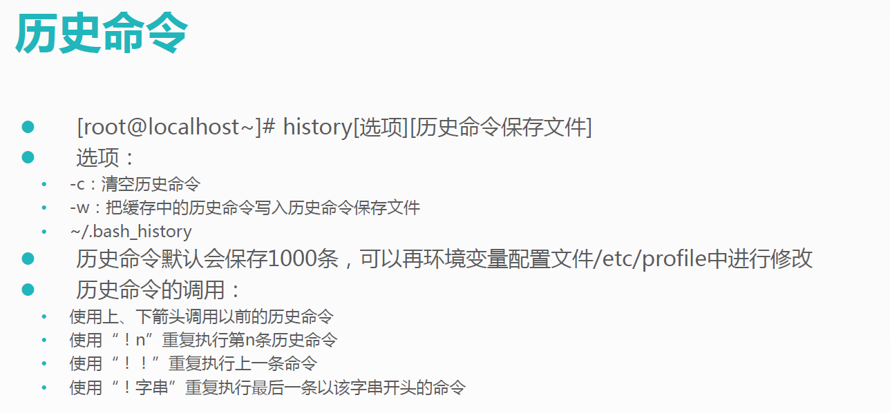
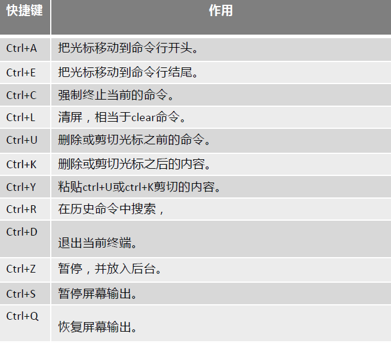
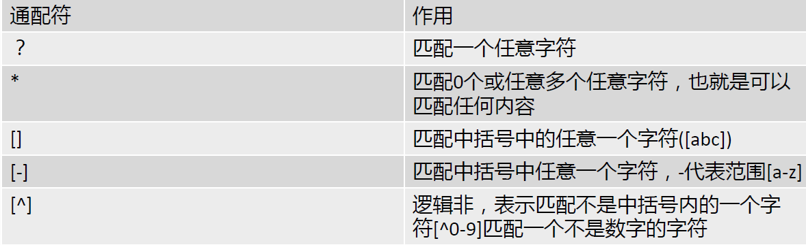
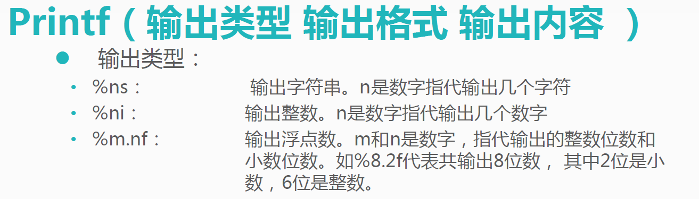

# Shell是什么

Shell是一个命令行解释器，它为用户提供了一个向Linux内核发送请求以便运行程序 的界面系统级程序，用户可以Shell 来启动、挂起停止甚至是编写一些程序。

Shell还是一个功能相当强大的编程语言， 易编写，调试灵活性较强。 Shell是解释执行的脚本语言，在 Shell中可以直接调用Linux系统命令。

# Shell 分类

Bourne Shell：从1979年起UNIX就开始使用 Bourne Shell的主文件名为sh。

C Shell主要在BSD版的UNIX系统中使用，其语法和C语言相类似而得名。

Shell的两种主要语法类型有 Bourne Bourne 和C，这两种语法彼此不兼容。

Bourne家族主要包括：sh 、ksh 、Bash Bash 、psh、zsh

C家族主要包括： csh 、tcsh

Bash：Bash与sh兼容，现在使用的Linux就是使用Bash作为用户的基本Shell 

Linux支持Shell：/etce/shells

## echo输出命令

## BASH基本功能

另在Bash中，命令与文件补全是非常方便常用的功能，我们只要在输入命令或文件时按“Tab”键就会自动进行补全。

## BASH常用快捷键

## 输入重定向

## 多命令顺序执行

## 管道符

## 通配符

## BASH中其他特殊符号

## 什么是变量

变量是计算机内存的单元，其中放值可以改。当Shell脚本需要保存一些信息时，如一个文件名或是一个数字，就把它存放在一个变量中。每个变量有一个我吹裙子时所以很容易 引用它。使用变量可以保存有用俯瞰，使系统获知相关设置，变量出发可以用于保存暂时信息息。

## 变量设置规则

变量名称可以由字母、数和下划线组成，但是不能以数字开头。如果变量名是“2name”则是错误的。

在Bash中，变量的默认类型都是字符串型，如果要进行数值运算，则必须指定变量类型为数值。

变量用等号连接值，左右两侧不能有空格。 

变量的值如果有空格，需要使用单引号或双包括。

在变量的值中，可以使用“ \”转义符。

如果需要增加变量的值，那么可以进行变量值的叠加。不过用双引号包含“ $变量名”或用 ${变量名}包含。

如果是把命令的结作为变量值赋予，则需要使用反引号或 $() 包含命令。

环境变量名建议大写，便于区分。

## 变量分类

用户自定义变量

环境变量：这种变量主要保存的是和系统操作相关的数据。

位置参数变量：这种主要是用来向脚本当中传递位置参，变量名不能自定义作用是固定的。

预定义变量：是Bash中已经定义好的变量，变量名不能自定义，变量作用也是固的。

## 环境变量是什么

用户自定义变量只在当前的Shell中生效，而环境变量会在在当前Shell和这个Shell的所有子Shell当中生效。如果把环境变量写入相应的配置文件，那么这个环境变量就会在把有的Shell中生效。

## 设置环境变量

申明变量 export 变量名 =变量值

查询变量 env

删除变量unset 变量名

## BASH的运算符

## 正则表达式

## 字符截断命令

## Print输出命令

## sed命令

## 行数据操作

## 字符串替换

## 排序命令

## 统计命令

# 流程控制 

## 单分支条件if语句

## 单分支条件语句需要注意的几个点

* if语句使用fi 结尾，和一般语言使用大括号不同结尾

* [条件判断式]就是使用test命令判断，所以中括号和条件式之间必须有空格

* then后面跟符合条件之执行的程序，可以放在[]之后，用 “；”分割。也可以换行写入，就不需要了 “；”分割。

## 双分支条件if语句

## 多分支条件if语句

## 多分支条件case语句

## while循环

## until循环

