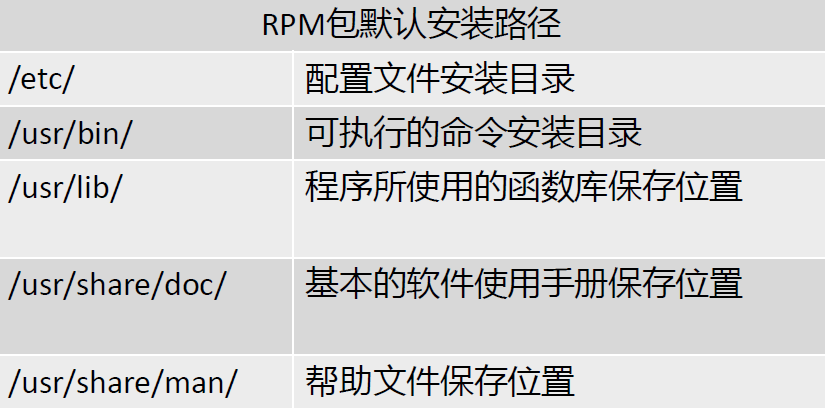

# 软件包分类

## 源码包

* 脚本安装包

## 二进制包

* RPM包、系统默认包

# RPM 包

## 二进制包的优点：

* 包管理系统简单，只通过几个命令就可以实现的安装、升级查询和卸载

* 安装速度比源码包快的多 

## 二进制的缺点：

* 经过编译，不再可以看到源代码

* 功能选择不如源码包灵活

* 依赖性

# RPM包管理-rpm命令管理

* 包全名：操作的包是没有安装软件时，使用全名而且要注意路径。
 
* 包名：操作已经安装的软件包时，使用包名。搜索 var/lib/rpm中的数据库。

## RPM安装

rpm -ivh ：

* -i（instal） 安装

* -v（verbose） 显示详细信息

* -h（hash） 显示进度

* -- nodeps 不检测依赖性

##RPM升级

rpm –Uvh 包全名

* -U（upgrade） 升级

## RPM卸载

rpm –e 包名

* -e （erase erase erase） 卸载

* -- nodeps nodeps不检查依赖性

## 查询是否安装

* [root@localhost~]# rpm –q 包名（查询是否安装）

* 选项：

	* -q 查询（query）

[root@localhost~]# rpm –qa （查询所有已经安装的 RPM 包）

* 选项：

	* -a所有

## 查询软件包详细信息

* [root@localhost~]# rpm –qi 包名

* 选项：

	* -i查询软件信息（information）

## 查询包中文件安装位置

* [root@localhostroot~]#rpm –ql 包名

* 选项：

-l 列表（list）

## 查询系统文件属于哪个rpm包

* [root@localhost~]# rpm –qf 系统文件名

* 选项：

	* -f  查询系统文件属于哪个包

## 查询软件包的依赖性

* [root@localhos~]rpm –qR 包名

* 选项：

	* -R  查询软件包的依赖性（requires）

## RPM包校验

* [root@localhost~]# rpm –V 已安装的包名

* 选项：

	* -V 校验指定 RPM 包中的文件（verify）

## RPM包校验

验证内容中的几个信息具体如下：

* S 文件大小是否改变

* M 文件的类型或权限（rwxrwx）是否被改变

* 5 文件MD5校验和是否改变（可以看成文件内容） 

* L 文件路径是否改变

* U 文件的属主（所有者）是否改变

* G 文件的属组是否改变

* T 文件的修改时间是否变

## 文件类型

* c， 配置文件（configconfig）

* d，普通文件（documentation）

* g，鬼文件（ghost file），很少见，就是该文件不应被这个RP 包含

* l，授权文件（license file）

* r，描述文件（ read me）

# 常用 yum 命令

## 查询

* [root@localhost yum.repos.d]yum list

* 查询所有可用软件包列表

* [root@localhostyum.repos.d ]yum search 关键字

* 搜索服务器上所有和关键字相的包

## 安装

* [root@localhostroot yum.repos.d]yum –y install 包名

* 选项

	* install 安装

	* -y 自动回答 yesyes

## 升级

* [root@localhost yum.repos.d ]yum –y update 包名

* 选项

	* update 升级

	* -y 自动回答 yes

## 卸载

* [root@localhost yum.repos.d]yum –y remove  包名
 
* 选项
	
	* remove 卸载

	* -y 自动回答 yes

# RPM包的安装位置

